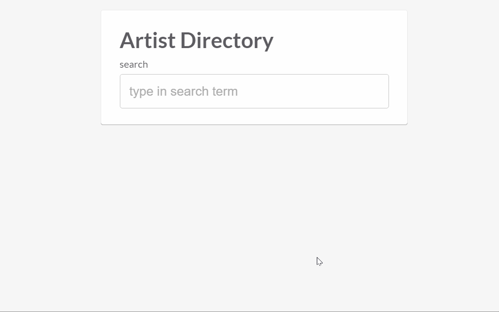

<p align="center" >
 


</p>


&nbsp;&nbsp;&nbsp;&nbsp;&nbsp;&nbsp;&nbsp;&nbsp;&nbsp;&nbsp;&nbsp;&nbsp;&nbsp;&nbsp;&nbsp;


# Movie_Artist_AngularJS2

:movie_camera: Practice AngularJS 2 + TypeScript +Gulp to create a single web app "Artist Directory"



## Dependencies

Before you get started, you need to make sure you have node.js installed. We'll be using `npm` to run this project (`npm` will be installed when you install node.js). You can [install node.js here](https://nodejs.org/en/).

## Installing

First, you need to make sure you install the dependencies:

```
npm install
```

Then we will 

- compile our TypeScript code and
- host the app on local development server 

by running the command:

```
npm run go
```

Then visit [http://localhost:8080](http://localhost:8080) in your browser. You should see an application with the header `Angular 2 Simple Reddit`. 

## Getting Help

In the case where it doesn't work, the first thing to try is looking at the developer console in your browser.

If that doesn't work, [come chat with us](https://gitter.im/ng-book/ng-book)!

## Other Files (advanced)

> What are all the other files in this repo?

- `tsconfig.json` - this is instructions for our TypeScript compiler
- `tslint.json` - `tslint` is a program and helps enforce rules about code style. The `tslint.json` is the config file that specifies conventions for this project.
- `vendor` - for this project we're using [Semantic-UI](http://semantic-ui.com/) for the CSS. We've included the CSS files from Semantic here.
- `resources` - this is where we store a few images

